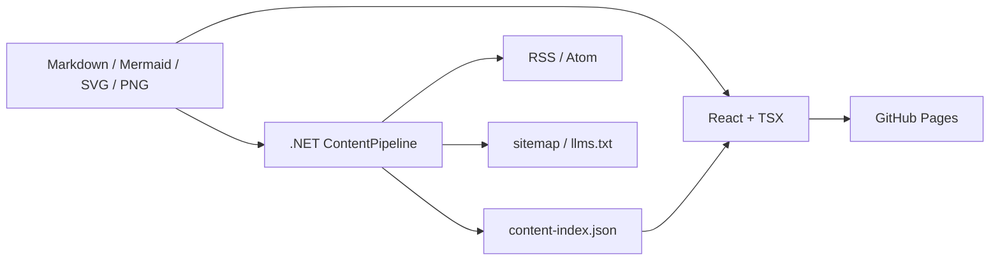

```mermaid
flowchart LR
  Content[Markdown / Mermaid / SVG / PNG] --> React[React + TSX]
  Content --> DotNet[.NET ContentPipeline]
  DotNet --> Index[content-index.json]
  DotNet --> Feeds[RSS / Atom]
  DotNet --> SEO[sitemap / llms.txt]
  React --> Pages[GitHub Pages]
  Index --> React
```
